.. _tutorial-1:

**********************
1: A First Calculation
**********************

.. Note::
   The flowchart for this tutorial is available at |flowchart_link| and also can be
   directly loaded into SEAMM by opening from Zenodo. The job for this tutorial is
   available on MolSSI's public server, |job_link|.

Introduction
------------
This tutorial mirrors the first tutorial in the `FHI-aims tutorial series`_, doing a
similar calculation in SEAMM. We'll create a water molecule and optimize the structure
using FHI-aims.

.. Note::
   This tutorial is almost identical to the `first SEAMM tutorial`_ but uses FHI-aims
   instead of DFTB+, and uses a different molecule -- water rather than ethanethiol. The
   steps are the same, but the some of the details are different. Since this is the
   first tutorial, we'll go through the steps in detail.
   

To get started, either double-click on the SEAMM app if you installed it, or open a
terminal and activate the `seamm` conda environment and start SEAMM:: 

  conda activate seamm
  seamm

This will bring up a window like the one shown below:

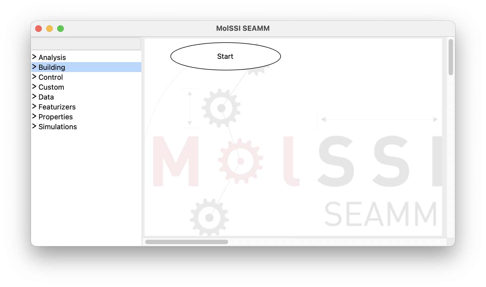
   
   SEAMM initial window

The window consists of two panes separated by a sash -- the grey line. If you hover over
the sash the cursor will change to a horizontal double-pointed arrow enabling the adjustment
of the pane sizes. The left pane contains the list of available plug-in categories. Clicking
on each category expands its content and represents it as a list of available plug-ins.
Clicking on the same point on the screen will hide the expanded list:

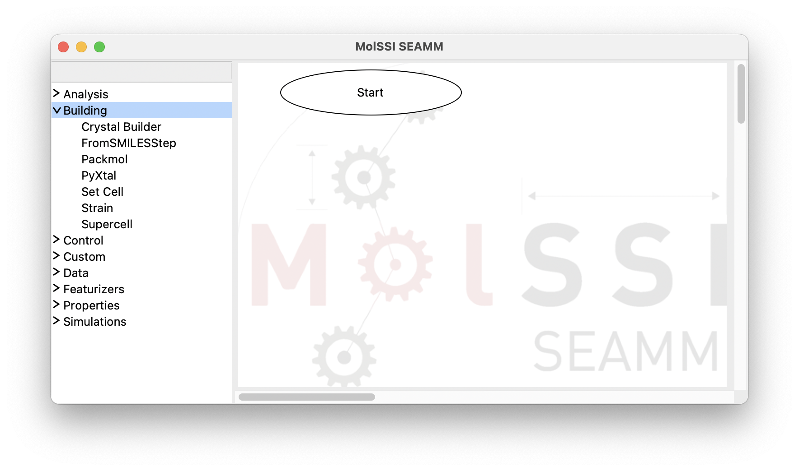

   The SEAMM window with the Building category of plug-ins expanded

The right-hand pane contains the initial step of a flowchart, ``Start``. There must be one
and only one start step in a flowchart because this is where execution starts. Users
cannot delete or add a ``Start`` step.

Creating the Flowchart
----------------------

Let us create a simple flowchart and add a molecule to it using :term:`SMILES`. SMILES
is a specific representation of a chemical structures in the string format. Then, we add
a new step, in which we optimize the geometry of the molecule, imported in the previous
step, with FHI-aims.

By clicking on the ``FromSmilesStep`` from the ``Building`` section, a rectangular box
for the new step labeled as ``from SMILES`` appears in the right pane. This box is also
connected to the ``Start`` step:

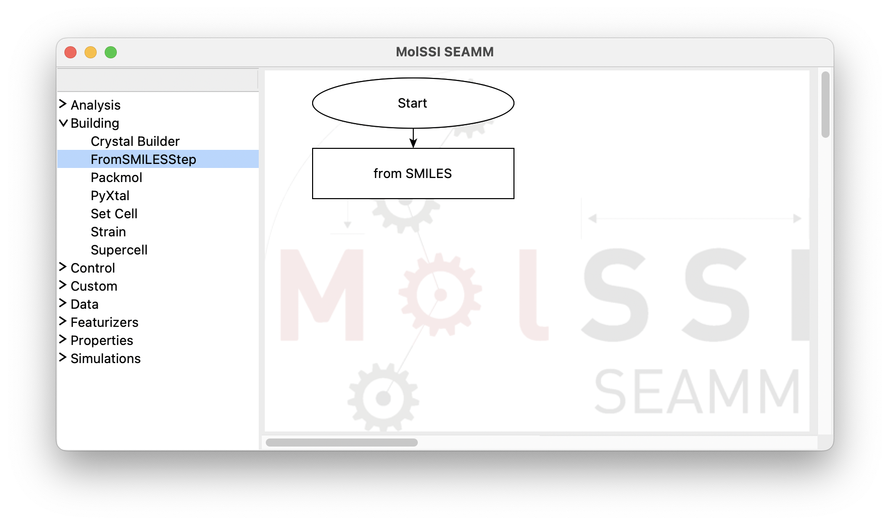

   The flowchart after adding the FromSMILESStep

If you have accidentally clicked twice on the ``FromSmilesStep`` or any other menu item
that you did not want, just right-click on the unwanted step and select ``delete`` from
the pop-up menu:

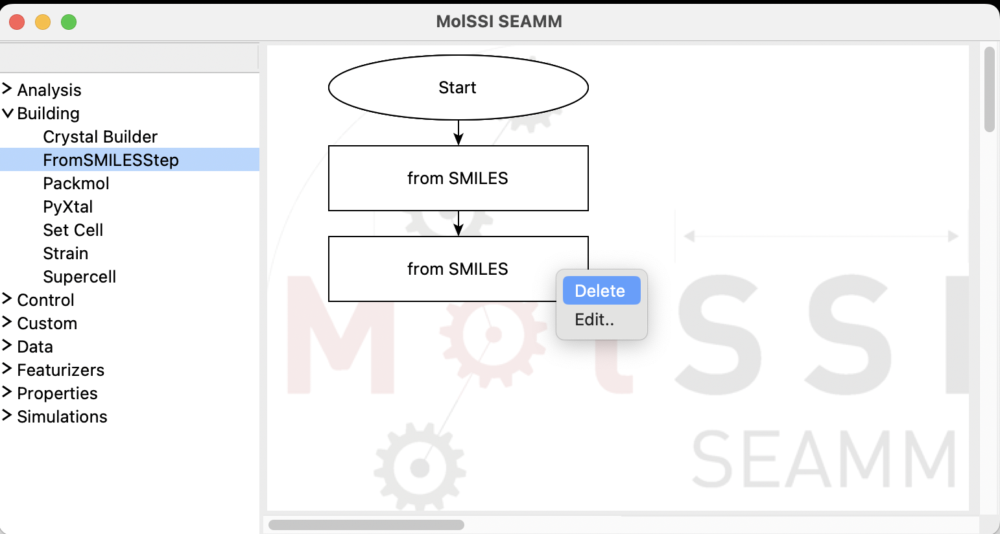

   Deleting a step from a flowchart

In the next stage, we need to set the SMILES string variable for the added
molecule. Almost every step has a dialog window that allows the users to set parameters
and control the details of the task in each step of the workflow. In order to access the
dialog, one can either right-click on the step box and select ``Edit...`` from the menu
or just double-click on the step box to open it:

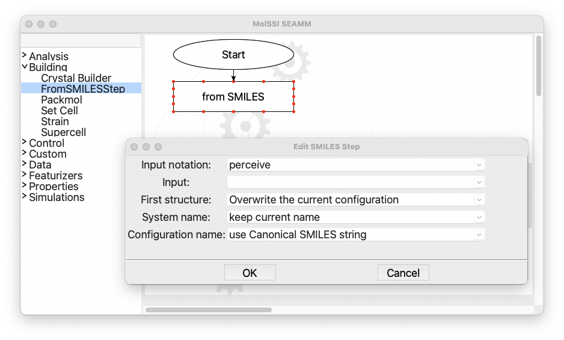

   The dialog for the FromSMILES step

Click in the field labeled ``Input:`` and type `O`, which is the SMILES representation
for water. Leave everything else as is and click on the ``OK`` button:

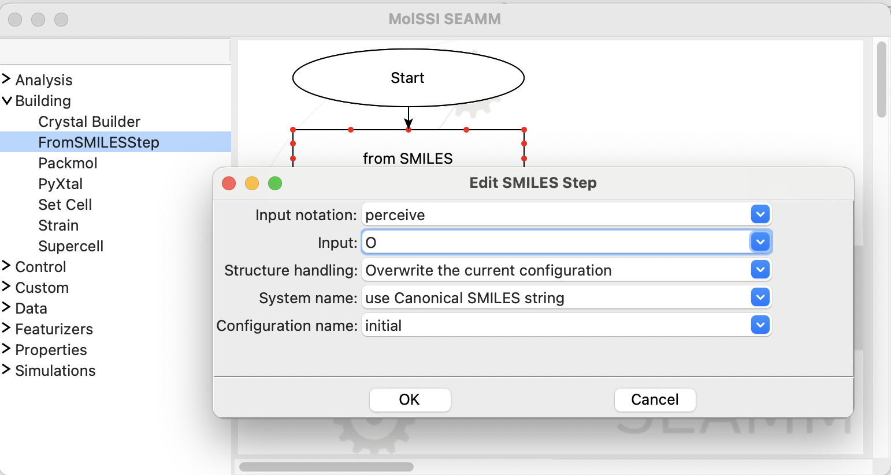

   The completed dialog for the FromSMILES step

.. note::
   While the name FromSMILES suggests that you need to enter SMILES, it has been
   enhanced over time to also handle chemical names, InChI, and InChIKeys. The first
   pulldown allows you to specifiy which you are entering; however, ``perceive`` will
   typically correctly understand the text that you typed in.

   You can also change how to store the new structure and the name of the system and
   configuration it is stored in, but for now just use the defaults.

Now, open the ``Simulations`` section in the left panel and add a ``FHI-aims`` step:

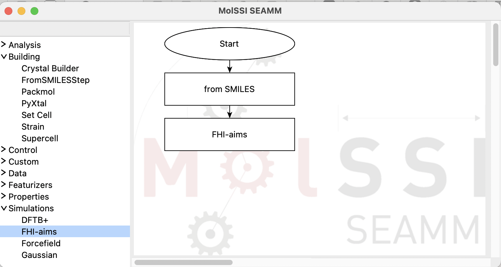

   The flowchart with the FHI-aims step added

Then, open the dialog for the FHI-aims step:

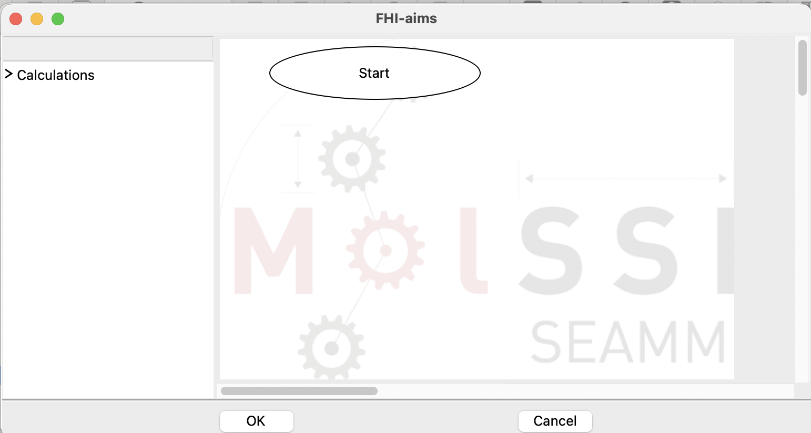

   The dialog for the FHI-aims step

Note that this dialog looks like the main SEAMM window. Some steps, like the ``FromSMILES``
step, perform one task and thus, can be handled by a single dialog. However, many
simulation codes such as FHI-aims are capable of performing multiple tasks and often have 
their own syntax.

Open the ``Simulation`` section on the left panel and add the ``Optimization`` step to
the subflowchart:

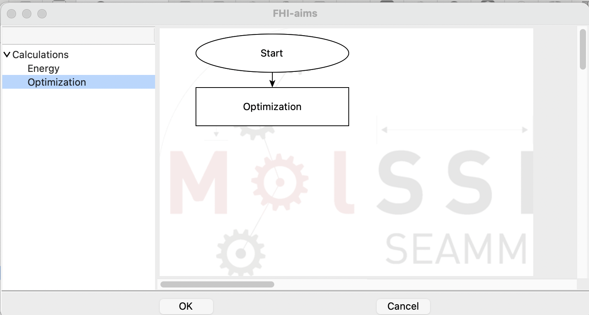

   The subflowchart for the FHI-aims step

Open the ``Optimization`` dialog:

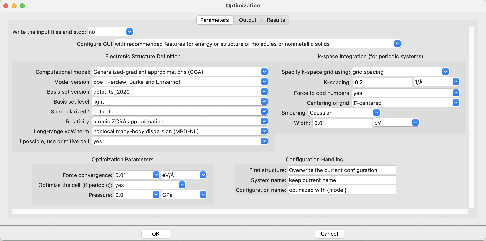

   The FHI-aims Optimization dialog

There are a number of control paramters available. On the left side of the dialog, there
are options for controlling the Hamiltonian and the physical approximations being
made. The right hand panel shows the options for the numerical integration over the
Brillouin zone for periodic systems. These options are ignored for molecular
systems. The bottom part of the dialog consists of parameters for controlling the
geometry optimization procedure.

SEAMM strives to have reasonable default values, so can start with the defaults, which
actually correspond almost exactly to the input specified in the FHI-aims tutorial for
water. The only difference is that by default the FHI-aims plug-in adds long-range van
der Waals terms. They will not affect the optimization of water, but you can turn them
off if you want to have an identical calculation to the generic FHI-aims tutorial.

.. note::
   FHI-aims and several other codes in SEAMM can handle both molecular and periodic
   systems, which is why you see options for using the primitive cell, the k-space
   integration grid, and whether to optimize the cell. These are ignored for molecular
   systems -- there is no cell -- but allow you to create flowcharts that can work with
   both molecular and periodic systems.

Before leaving the dialog, click on the ``Output`` tab at the top of the dialog:

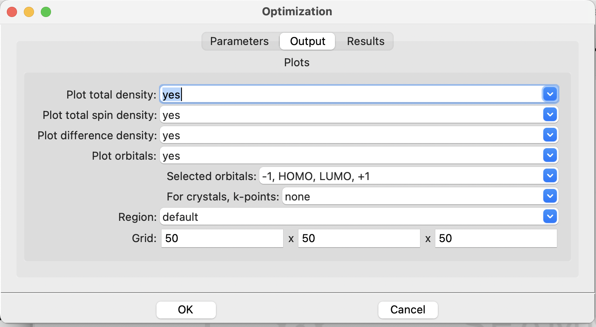

   The FHI-aims Optimization dialog, output tab

This is where you control plotting the total charge density, spin-density (for
spin-polarized calculations), and orbitals. By default it does not plot any densities or
orbitals. Change the items to ``yes``, leaving the selected orbitals ``-1, HOMO, LUMO,
+1`` which asks the code to plot the HOMO and LUMO orbitals as well as the next orbital
below the HOMO (-1) and the next orbital above the LUMO (+1). Again you see some
controls for periodic systems, which you can ignore. The defaults are fine, so click
``Cancel`` to close the dialog with no changes.

.. tip::
   If you do not intend to make any changes in a dialog, it is a good idea to close it with
   the ``Cancel`` button. It is a common habit to click ``OK``, but pressing ``OK``
   saves any changes including ones you made accidentally by e.g. looking at the options
   in a pulldown. Such a mistake can lead to a calculation that you didn't intend, with
   puzzling results. We recommend using the ``Cancel`` button in any dialog in SEAMM or
   any other program unless you actually want to make changes. It is a good habit to get
   into.

Click ``OK`` to close the dialog to save your changes.

Running the Job
---------------

To submit the flowchart as a Job, click on the ``File`` menu and select ``Run`` or use
the accelerator (⌘R on a Mac, ^R on Windows or Linux) to get the following dialog:

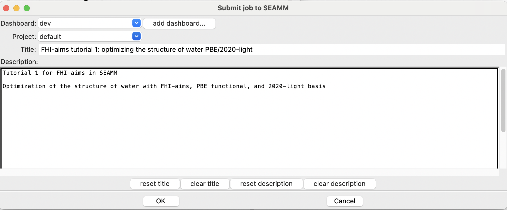

   The Run dialog in SEAMM

.. Note::
   The very first time you run, you will need to provide a username and password for the
   Dashboard. If so, this dialog will appear first:
   
   .. figure:: images_1/dashboard_login.png
      :align: center
      :alt: The login information for the Dashboard

      The login information for the Dashboard

   If you don't know your username and password go to `Managing the Dashboard`_ and
   then come back here.

Add a useful title in the ``Title`` field. Briefly describe your goal and the details of
your simulation workflow within the large text area at the bottom of the
dialog. Finally, click ``OK`` to execute the calculation.

As noted at the beginning this tutorial you can download the flowchart from
|flowchart_link| and view the results of the calculation in the public MolSSI Dashboard
at |job_link|.

The `second SEAMM tutorial`_ will show you how to look at your job and its results in
the Dashboard. 

Topics Covered
--------------
#. Adding steps to a flowchart.
#. Editing the parameters for the steps.
#. Submitting a job.

.. Shortcut link
.. |flowchart_link| raw:: html

   <a href="https://doi.org/10.5281/zenodo.14020321" target="_blank">Zenodo</a>

.. |job_link| raw:: html

   <a href="http://molssi10.molssi.org:55055/#/jobs/423" target="_blank">Job 423</a>

.. _FHI-aims tutorial series: https://fhi-aims-club.gitlab.io/tutorials/basics-of-running-fhi-aims/
.. _Managing the Dashboard: https://molssi-seamm.github.io/getting_started/installation/dashboard_management.html#dashboard-management
.. _first SEAMM tutorial: https://molssi-seamm.github.io/getting_started/tutorials/tutorial_1.html
.. _second SEAMM tutorial: https://molssi-seamm.github.io/getting_started/tutorials/tutorial_2.html
